<p align="center">
  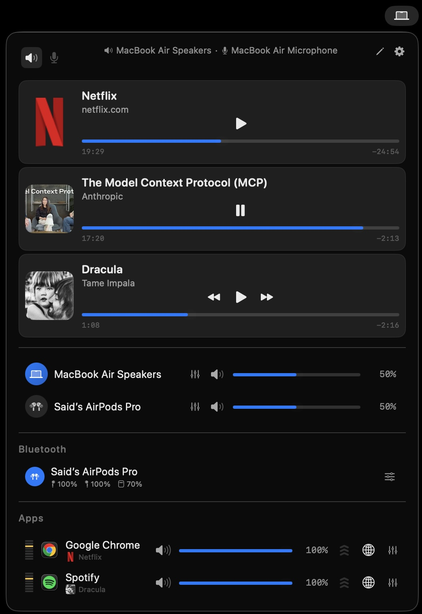
</p>

<h1 align="center">SoundTune</h1>

<p align="center">
  Per-app volume, EQ, device routing, media keys &amp; Bluetooth management — all from the menu bar.
</p>

<p align="center">
  
  
  
  
</p>

---

## Overview

SoundTune lives in your menu bar and gives you precise control over every app's audio — without touching the macOS system volume. Route apps to different speakers, apply per-app or per-device EQ, correct headphone frequency response with AutoEQ profiles, intercept media keys with a custom HUD, and manage Bluetooth audio devices from a single popup.

---

## Features

### Per-App Volume, Mute & Boost
Control the volume and mute state of every running audio app independently — in real time with no audible glitch. You can also **boost** any app beyond 100% when you need extra loudness from a quiet source.

<p align="center">
  
</p>

---

### Device Routing
Send any app to a different output device — headphones, speakers, or a virtual aggregate — regardless of the system default. Each app remembers its assigned device across relaunches.

<p align="center">
  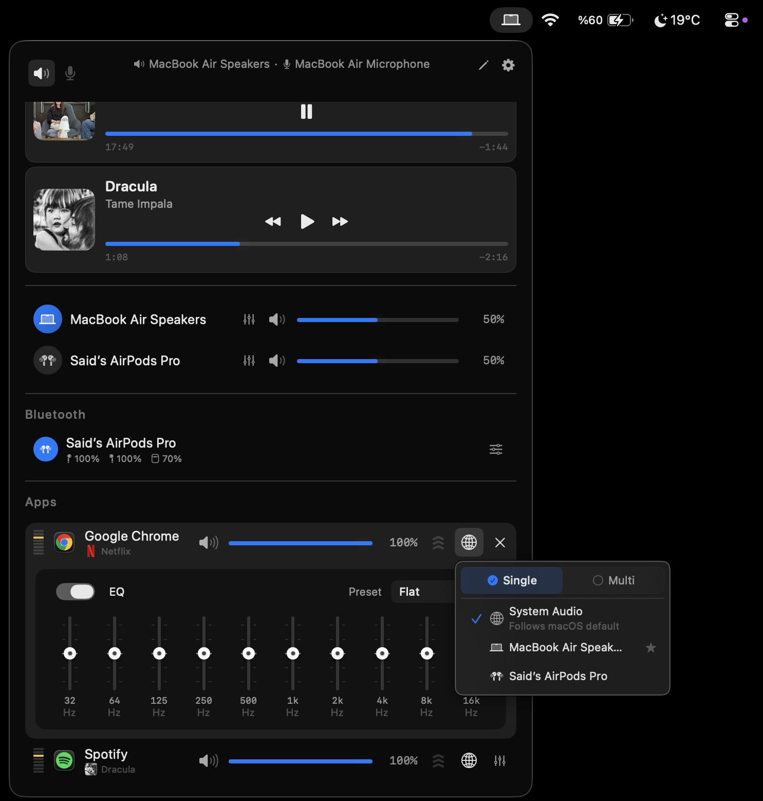
</p>

---

### Multi-Output
Play audio through multiple devices simultaneously. Configure your multi-output group and any app can be routed to it with one tap.

<p align="center">
  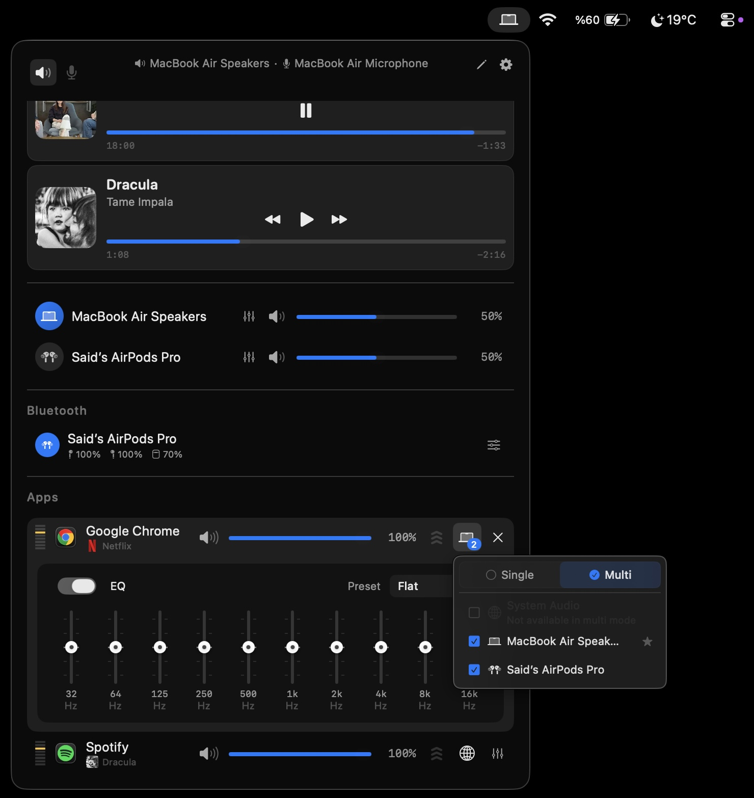
</p>

---

### Per-App EQ
Apply a 10-band parametric equalizer to individual apps. Save unlimited named presets and switch between them instantly.

<p align="center">
  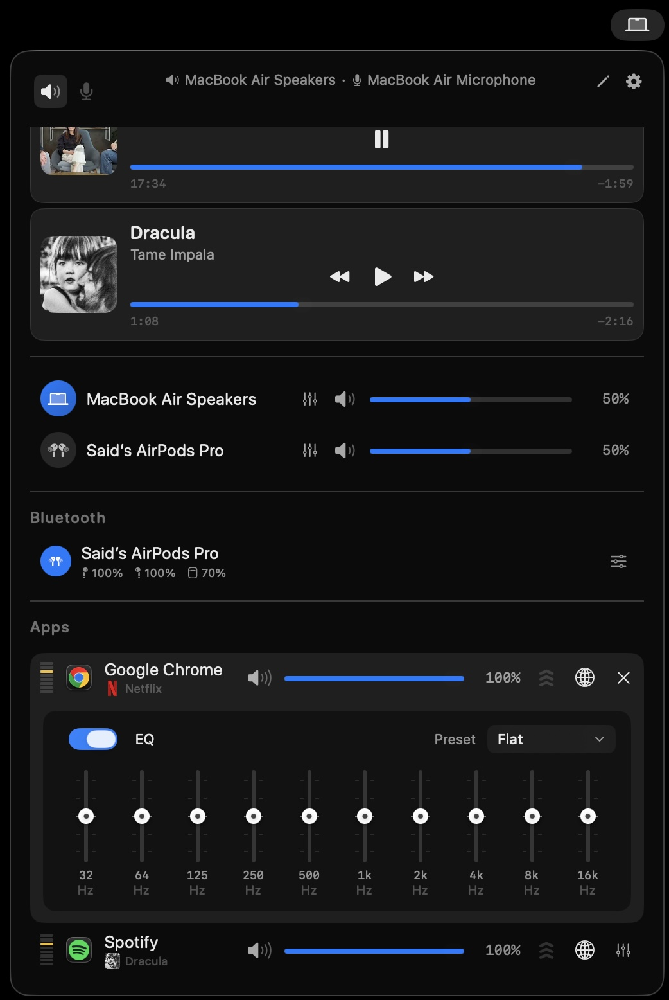
</p>

---

### Per-Device EQ
Equalise at the device level so every app routed to that output shares the same correction curve — ideal for room correction or speaker tuning.

<p align="center">
  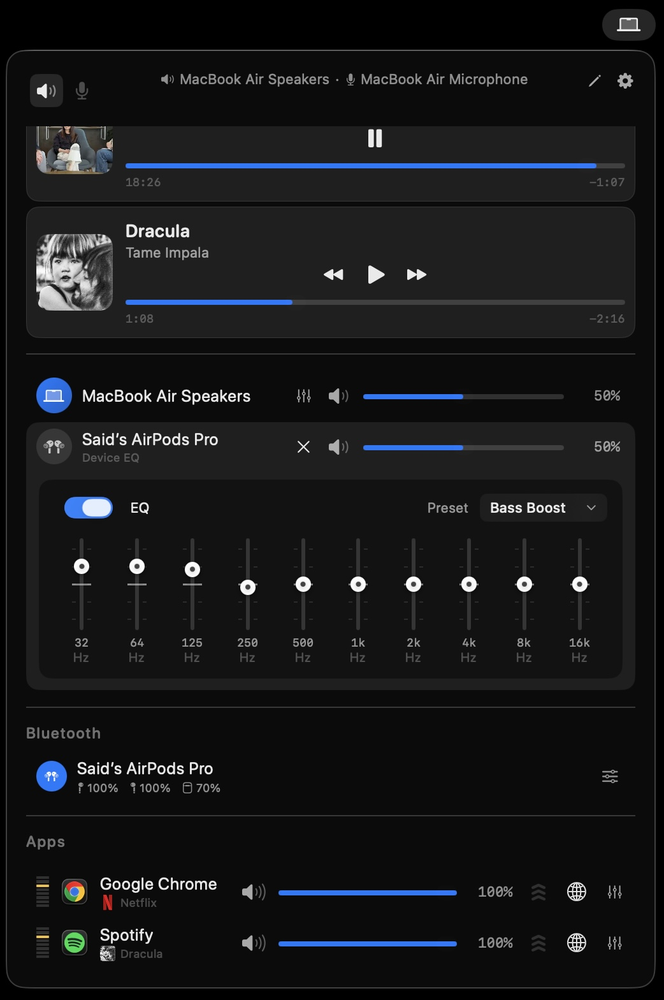
</p>

---

### AutoEQ — Headphone Correction
SoundTune ships with a searchable library of community-measured headphone profiles (AutoEQ). Select your headphone model and SoundTune automatically applies the optimal frequency correction, making any pair of headphones sound as flat and accurate as possible.

---

### Device Priority & Auto-Switching
Define a priority order for your output devices. When a higher-priority device becomes available (e.g. you plug in headphones), SoundTune automatically switches to it. When it disconnects, it falls back down the list — no manual switching needed.

---

### Now Playing & Transport Controls
SoundTune shows live media cards for every app producing audio — including individual browser tabs. Play, pause, skip, and seek directly from the popup. Works with music apps and browsers without requiring media-key access.

---

### Media Keys & Volume HUD
SoundTune can intercept the system media keys (F10 / F11 / F12 / volume keys) so they target the correct app instead of the OS default. A floating HUD displays the current volume level on every key press — available in Tahoe (large) and classic (compact) styles.

---

### Global Hotkeys
Assign keyboard shortcuts to volume up/down, mute, and target-app actions. Works system-wide using Carbon-backed shortcuts — **no Accessibility permission required**.

<p align="center">
  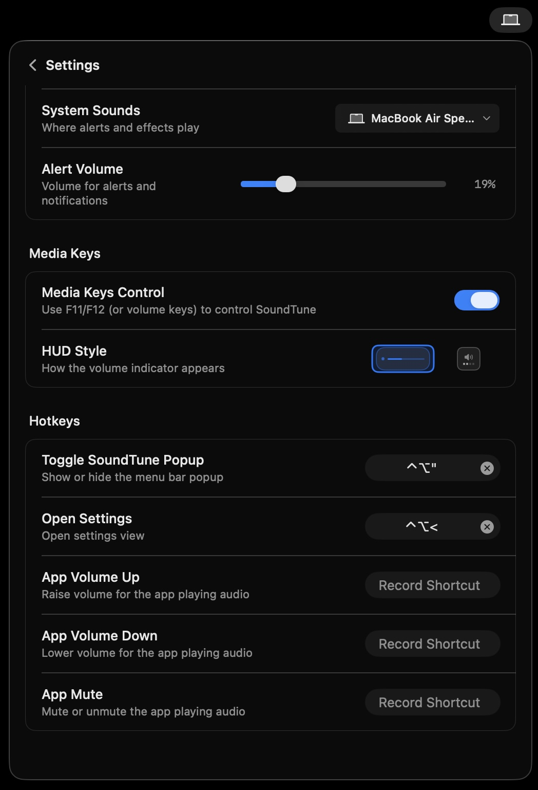
</p>

---

### Bluetooth Device Management

SoundTune shows all paired Bluetooth audio devices — their registration status, live connection state, and battery level — in one place.

**Smart auto-connect:** If Bluetooth is turned off on your Mac but a paired device is available and connectable, SoundTune can automatically power on Bluetooth and connect the device as the active audio output. No manual steps needed — just open the popup and tap connect.

<p align="center">

| Registered devices | Connection status | Battery level |
|:---:|:---:|:---:|
| 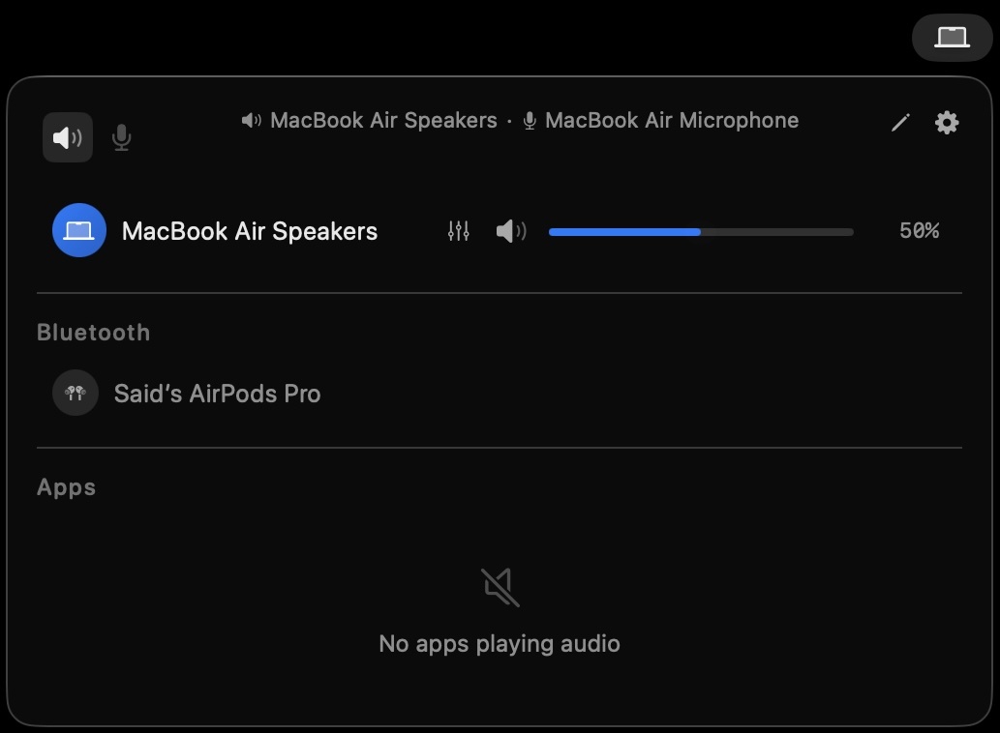 | 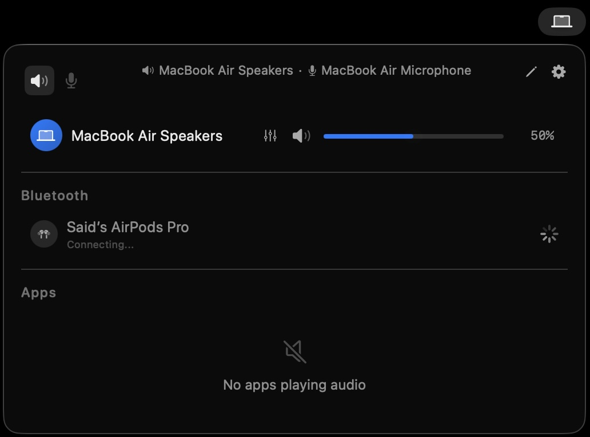 | 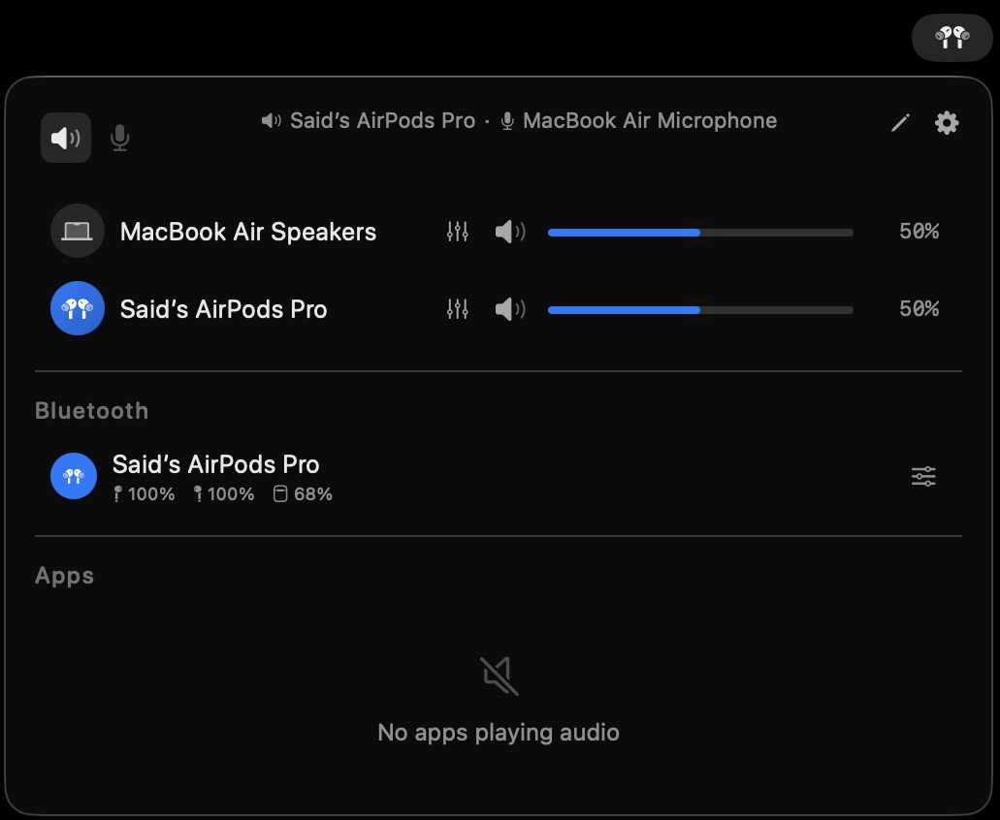 |

</p>

---

### Light Theme

Full support for macOS Light and Dark appearance, plus a standalone Light theme available from Settings.

<p align="center">

| App | Settings |
|:---:|:---:|
| 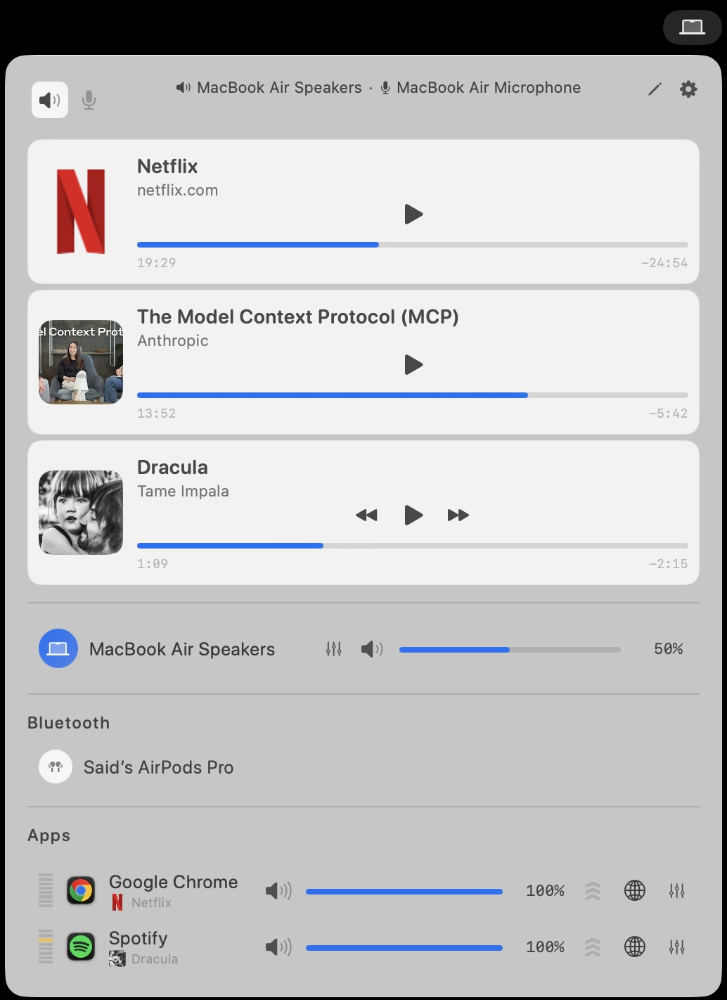 | 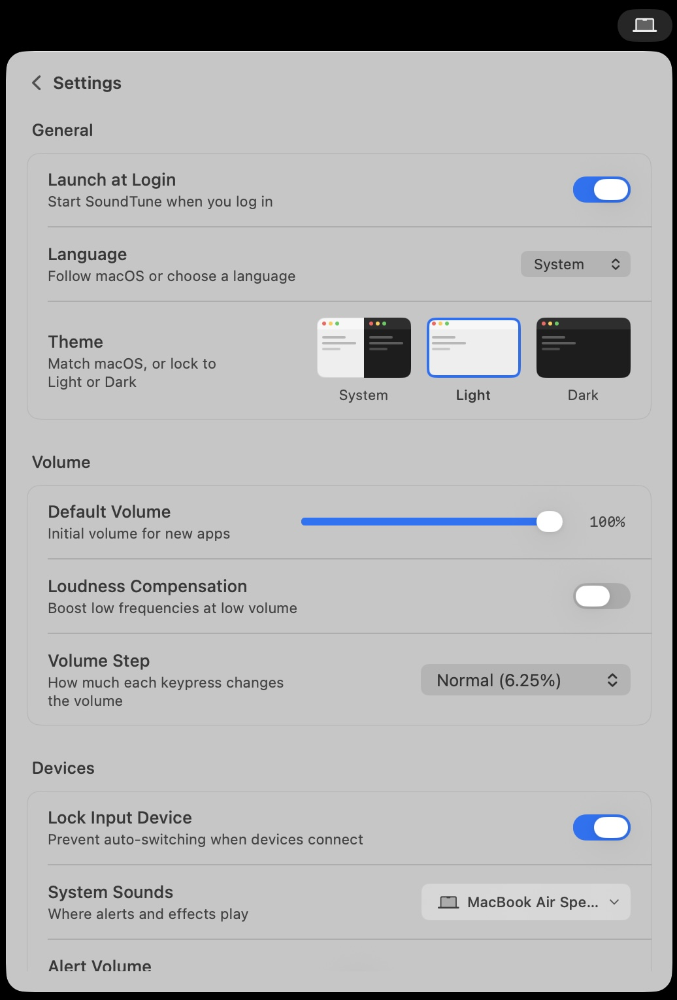 |

</p>

---

### Settings

<p align="center">

| | |
|:---:|:---:|
| 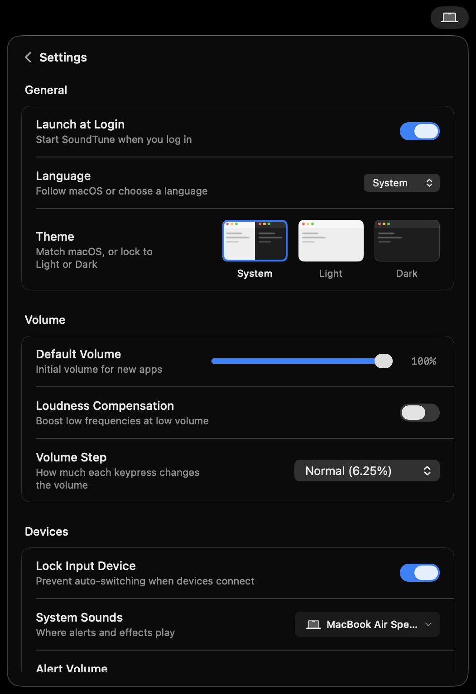 | 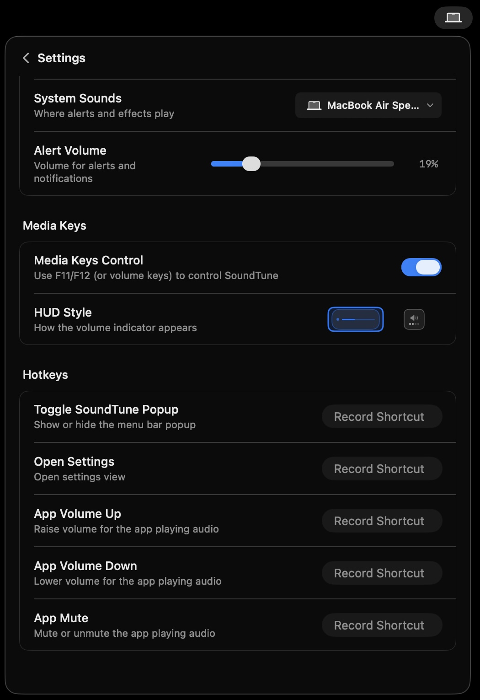 |

</p>

---

### Right-Click Menu
Quick access to common actions directly from the menu bar icon — without opening the full popup.

<p align="center">
  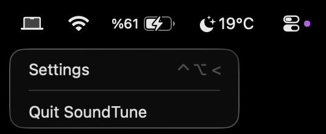
</p>

---

### Language Support
SoundTune ships with full **English** and **Turkish** localisation. Switch languages at any time from Settings without restarting.

<p align="center">
  
</p>

---

### URL Scheme Automation
Automate SoundTune from scripts, Shortcuts, or other apps using the `soundtune://` URL scheme:

```
soundtune://set-volumes?app=com.spotify.client&volume=80
soundtune://toggle-mute?app=com.apple.Music
soundtune://set-device?app=com.spotify.client&device=AirPods Pro
soundtune://step-volume?app=com.spotify.client&step=10
soundtune://reset
```

---

## Requirements

- **macOS 15.4 or later**
- Xcode 26 or later (for building from source)

---

## Installation

1. Download **SoundTune-1.0.dmg**
2. Open the DMG and drag **SoundTune.app** into your **Applications** folder
3. Launch SoundTune from Applications or Spotlight

> **Security note:** SoundTune is not signed with an Apple Developer ID. On first launch macOS may show a security prompt. Open it via: **System Settings → Privacy & Security → scroll down → Open Anyway**, or right-click the app and choose **Open**.

---

## Permissions

macOS will ask for the following permissions on first launch:

| Permission | Why |
|---|---|
| **Screen & System Audio Recording** | Required to capture and control per-app audio via CATap |
| **Accessibility** | Required only if you enable SoundTune media-key interception |
| **Bluetooth** | Used to show paired device info, battery, and auto-connect |

---

## Build from Source

```bash
git clone https://github.com/saidasilsoyy/SoundTune.git
cd SoundTune

xcodebuild \
  -project SoundTune.xcodeproj \
  -scheme SoundTune \
  -configuration Release \
  -destination 'platform=macOS' \
  -onlyUsePackageVersionsFromResolvedFile \
  -disableAutomaticPackageResolution \
  build
```

Run tests:

```bash
xcodebuild \
  -project SoundTune.xcodeproj \
  -scheme SoundTune \
  -configuration Debug \
  -destination 'platform=macOS' \
  -onlyUsePackageVersionsFromResolvedFile \
  -disableAutomaticPackageResolution \
  test
```

---

## Architecture

SoundTune is a macOS menu-bar agent (`LSUIElement`). The audio pipeline intercepts per-app audio using CoreAudio CATap and routes it through a real-time gain/mute/EQ/AutoEQ/limiter chain before passing it to the selected output device.

Key components:

- **AudioEngine** — core orchestrator; owns CATap lifecycle, EQ, AutoEQ, device priority, crossfade, crash recovery
- **ProcessTapController** — per-PID CoreAudio tap with RT-safe callback
- **SettingsManager** — persisted JSON settings (schema v11)
- **AppMediaInfoService** — AppleScript + JS media metadata polling
- **MediaKeyMonitor** — CGEventTap for system media keys
- **ShortcutsRegistry** — Carbon-backed global hotkeys

See [CLAUDE.md](CLAUDE.md) for the full architecture and code conventions.

---

## SPM Dependencies

| Package | Purpose |
|---|---|
| `FluidMenuBarExtra` | Menu bar popup rendering |
| `KeyboardShortcuts` | Global hotkey binding |
| `swift-snapshot-testing` | UI snapshot tests |

---

## License

MIT — see [LICENSE](LICENSE).
